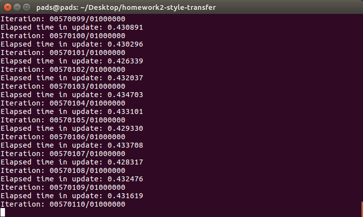
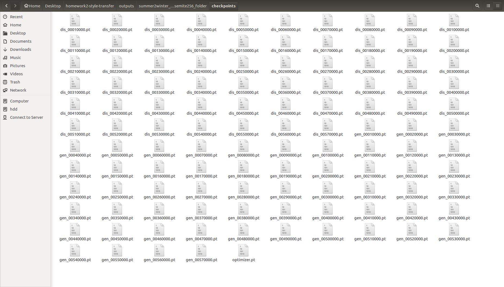
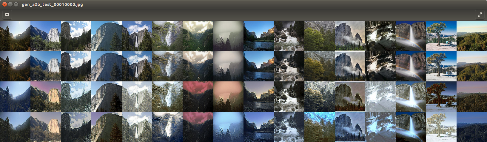
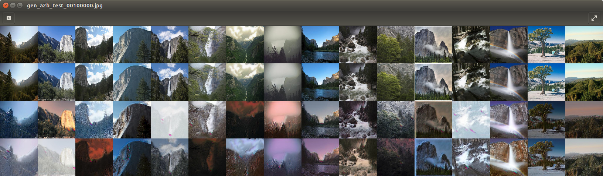
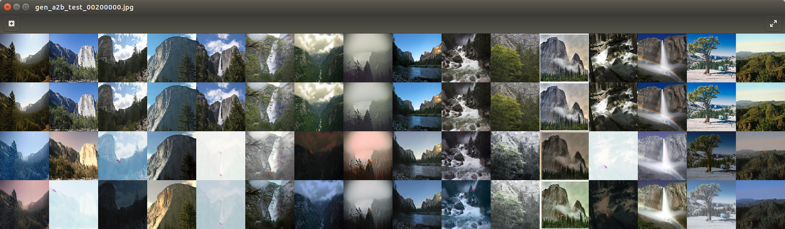
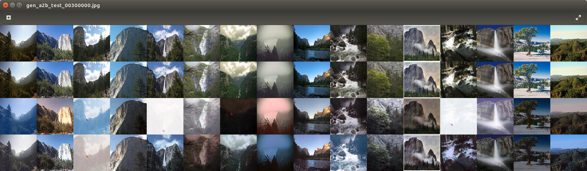
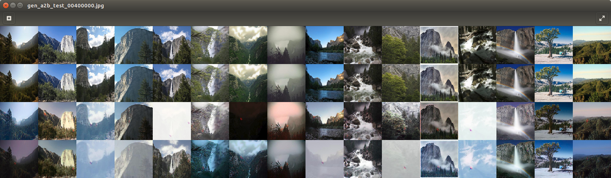
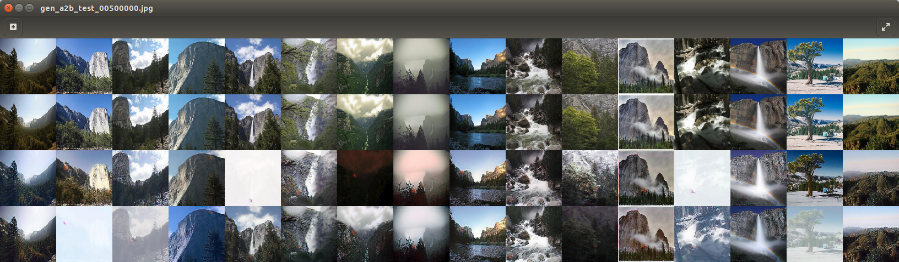
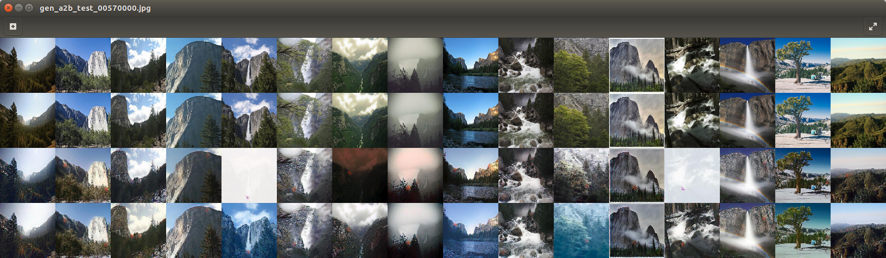

# homework2

**電腦視覺特效-第六組**  
  
## Training  
  
* 在這次作業training的時候，我們這組所選擇的dataset為summer2winter_yosemite此組dataset，而在training的過程中，我們組員原本認為training 一百萬個iterations大概只要花費兩天的時間，而在training到整整三天後，發現iterations只有跑到五十七萬。因為時間不足的因素，所以我們model只有training 到五十七萬iterations。(附圖是我們這次training過程中所顯示的資訊)  
  
  
  
* 以下附圖是training的過程中，每10000 iterations會儲存的checkpoints pt檔案(含有discriminator 以及 generator)
  

  
* 以下training過程中，各個iterations(分別為1萬 10萬 20萬 30萬 40萬 50萬 57萬)在A to B(summer to winter) 結果照片顯示。每張照片的第一列為圖片原本的content，而在第二列至第五列分別為原本圖片換上有winter style的結果圖，而由以下圖片可以得知，training iterations的多寡，在某些圖片上面並不能證明iterations越多，style transfer效果會越好。
  
  
  
  
  
  
  

## Inference
  
**content**\\**style** 

 

 

 

 

 

 

 

 

 
  
    
## Compare with other method  

  
  
  

